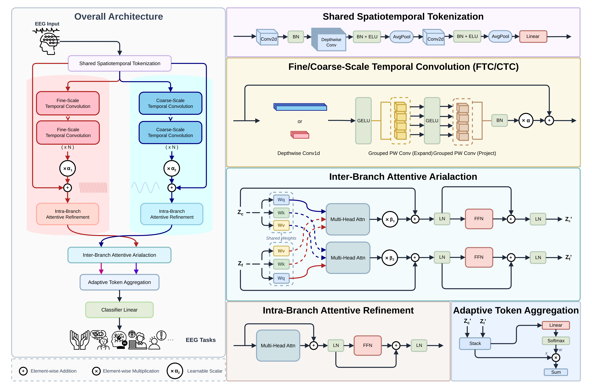

<div align="center">
<h1>🧠 DSAINet</h1>
<h2> An Efficient Dual-Scale Attentive Interaction Network for General EEG Decoding</h2>
</div>

This repository provides the official implementation of **"DSAINet: An Efficient Dual-Scale Attentive Interaction Network for General EEG Decoding"**.

## 📖 Overview
The overall architecture can be summarized as below:
- **Shared Spatiotemporal Tokenization**: Converts raw EEG signals into compact shared spatiotemporal tokens for subsequent modeling.
- **Fine/Coarse-Scale Temporal Convolution**: Uses two parallel temporal branches with different receptive fields to capture fine- and coarse-scale temporal patterns.
- **Intra-Branch Attentive Refinement**: Refines branch-wise features by strengthening salient scale-specific token relationships within each branch.
- **Inter-Branch Attentive Interaction**: Enables explicit bidirectional information exchange between fine- and coarse-scale representations.
- **Adaptive Token Aggregation**: Aggregates branch outputs into compact representations by assigning larger weights to more informative tokens.

<p align="center">
  
</p>

## ✨ Highlights
- **Unified architecture** with **consistent architecture-related hyperparameters** across datasets
- **Dual-scale temporal modeling** with fine- and coarse-scale branches
- **Structured attention** for within-scale refinement and cross-scale interaction
- **Strict subject-independent evaluation** on **10 public EEG datasets**
- **Strong accuracy-efficiency trade-off** with only **~77K parameters**
- **Interpretable** saliency maps and learned attention patterns

## 📂 Code Structure

```text
DSAINet/
├── config/
│   └── DSAINet.yaml        # Default configuration for training and model
├── model/
│   └── DSAINet.py          # Main DSAINet architecture implementation
├── preprocess/             # Preprocessing scripts for each dataset
│   ├── BCIC_IV_2a.py
│   ├── BCIC_IV_2b.py
│   ├── Zhou2016.py
│   ├── OpenBMI.py
│   ├── PhysioNet_MI.py
│   ├── Mumtaz2017.py
│   ├── ADFTD.py
│   ├── EEGMat.py
│   ├── Shin2018.py
│   └── Rockhill2021.py
├── utils/
│   ├── load_data.py        # Unified data loading interface
│   ├── load_model.py       # Build model according to config
│   ├── norm.py             # Normalization / alignment methods
│   └── util.py             # Logging, seeding, augmentation, etc.
├── train_loso.py           # LOSO evaluation (leave-one-subject-out)
├── train_kfold.py          # K-fold evaluation (subject-wise KFold)
└── figure/
    └── main.png            # Network architecture illustration
```


## 🚀 Quick Start

> [!IMPORTANT]
> Please update the **dataset path**, **log directory**, and **checkpoint save directory** to match your local setup before training or evaluation.

DSAINet is evaluated under two **subject-independent** protocols:
- **LOSO (Leave-One-Subject-Out)** for datasets with relatively limited subject numbers.
- **Subject-level K-Fold Cross-Validation** for the remaining datasets.

### ⚙️ Common arguments
- `--config`: path to the model configuration file
- `--dataset`: dataset name
- `--batch-size`: batch size
- `--lr`: learning rate
- `--epochs`: number of training epochs
- `--seed`: random seed
- `--device`: GPU device ID

### 👤 LOSO (Leave-One-Subject-Out)

#### BCIC-IV-2a
```bash
python train_loso.py --config config/DSAINet.yaml --dataset BCIC-IV-2a --batch-size 32 --lr 0.001 --epochs 100 --seed 0 --device 0
```

#### BCIC-IV-2b
```bash
python train_loso.py --config config/DSAINet.yaml --dataset BCIC-IV-2b --batch-size 32 --lr 0.001 --epochs 100 --seed 0 --device 0
```

#### Zhou2016
```bash
python train_loso.py --config config/DSAINet.yaml --dataset Zhou2016 --batch-size 32 --lr 0.001 --epochs 100 --seed 0 --device 0
```

### 🔁 Subject-level K-Fold Cross-Validation

#### OpenBMI
```bash
python train_kfold.py --config config/DSAINet.yaml --dataset OpenBMI --batch-size 128 --lr 0.001 --epochs 100 --seed 0 --device 0
```

#### PhysioNet-MI
```bash
python train_kfold.py --config config/DSAINet.yaml --dataset PhysioNet-MI --batch-size 128 --lr 0.001 --epochs 100 --seed 0 --device 0
```

#### Mumtaz2017
```bash
python train_kfold.py --config config/DSAINet.yaml --dataset Mumtaz2017 --batch-size 128 --lr 0.0001 --epochs 30 --seed 0 --device 0
```

#### ADFTD
```bash
python train_kfold.py --config config/DSAINet.yaml --dataset ADFTD --batch-size 128 --lr 0.0001 --epochs 30 --seed 0 --device 0
```

#### Rockhill2021
```bash
python train_kfold.py --config config/DSAINet.yaml --dataset Rockhill2021 --batch-size 32 --lr 0.0001 --epochs 30 --seed 0 --device 0
```

#### EEGMat
```bash
python train_kfold.py --config config/DSAINet.yaml --dataset EEGMat --batch-size 32 --lr 0.001 --epochs 30 --seed 0 --device 0
```

#### Shin2018
```bash
python train_kfold.py --config config/DSAINet.yaml --dataset Shin2018 --batch-size 32 --lr 0.001 --epochs 100 --seed 0 --device 0
```